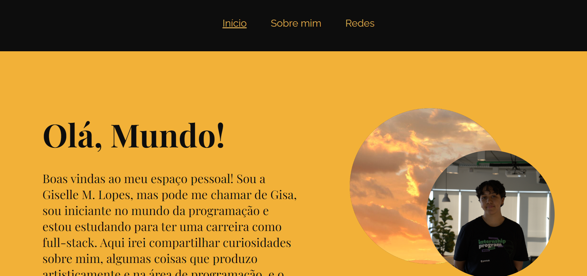
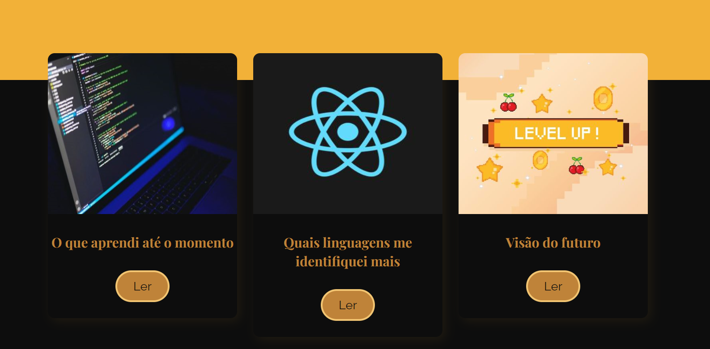

# Olá, mundo! 

### Descrição do projeto:
	
   Este projeto foi desenvolvido inicialmente junto ao curso da plataforma Alura desenvolvendo em React Router com JavaScript, e, após o interesse no projeto, foi tida a continuidade deste, como ferramenta para estudos e melhorias no desempenho de hard skills.
 O projeto se trata de uma página de apresentação, com introdução e cards de curiosidades sobre a pessoa que ali está sendo relacionada. Toda a estrutura de cores e imagens escolhidas para os cards foi baseada no conteúdo ali apresentado.

### Funcionalidades:

O projeto em si é utilizado apenas como uma apresentação, pode ser até uma aplicação no meio profissional, como exemplo em portfólios, ou, como base de estudos, mas sua funcionalidade em si é servir como base de apresentação do indivíduo ali inserido.
Destaca uma introdução e de forma adequada apresenta outras propostas de assuntos relacionados ao indivíduo.
Em meu caso, particularmente, utilizei como fonte de estudos para melhorias no meu desenvolvimento em coding skills, então trazendo algumas curiosidades e fatos descontraídos sobre mim para dentro da página.

### Ferramentas utilizadas:
* JavaScript
* React
* Visual Studio Code

### Acesso ao projeto:
      Caso tenha despertado seu interesse em ver como o projeto ficou, aqui está o link para acesso.

### Desenvolvedores:
_Giselle Machado Lopes_

